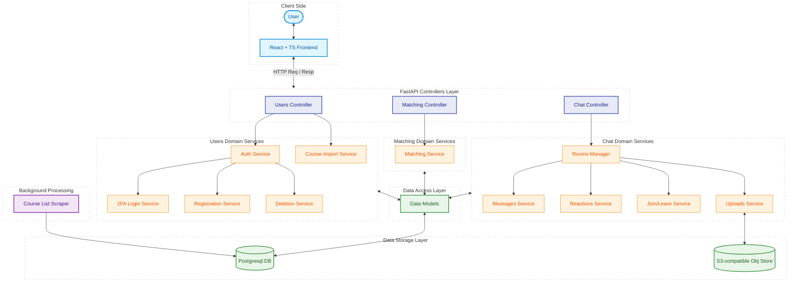

# CPS420-Project
The group's project for CPS 420 at the University of Dayton

---

### System Architecture Diagram

```mermaid
graph TD
    %% Custom Styling
    classDef clientStyle fill:#e1f5fe,stroke:#0288d1,stroke-width:2px,color:#01579b;
    classDef controllerStyle fill:#e8eaf6,stroke:#3f51b5,stroke-width:2px,color:#1a237e;
    classDef serviceStyle fill:#fff3e0,stroke:#f57c00,stroke-width:1px,color:#e65100;
    classDef dataStyle fill:#e8f5e9,stroke:#388e3c,stroke-width:2px,color:#1b5e20;
    classDef toolStyle fill:#f3e5f5,stroke:#7b1fa2,stroke-width:2px,color:#4a148c;

    %% Subgraph Section Styling (Transparent Background)
    style Client_Layer fill:none,stroke:#ccc,stroke-dasharray: 5 5;
    style Controllers fill:none,stroke:#ccc,stroke-dasharray: 5 5;
    style Users_Domain fill:none,stroke:#ccc,stroke-dasharray: 5 5;
    style Chat_Domain fill:none,stroke:#ccc,stroke-dasharray: 5 5;
    style Matching_Domain fill:none,stroke:#ccc,stroke-dasharray: 5 5;
    style Data_Access fill:none,stroke:#ccc,stroke-dasharray: 5 5;
    style Background fill:none,stroke:#ccc,stroke-dasharray: 5 5;
    style Storage fill:none,stroke:#ccc,stroke-dasharray: 5 5;

    %% 1. Client Layer
    subgraph Client_Layer ["Client Side"]
        U([User])
        RE[React + TS Frontend]
    end

    %% 2. API Entry (Controllers)
    subgraph Controllers ["FastAPI Controllers Layer"]
        UC[Users Controller]
        CC[Chat Controller]
        MC[Matching Controller]
    end

    %% 3. Domain Services
    subgraph Users_Domain ["Users Domain Services"]
        A_SVC[Auth Service]
        C_IMP[Course Import Service]
        LOGIN_SVC[2FA Login Service]
        REG_SVC[Registration Service]
        DEL_SVC[Deletion Service]
    end

    subgraph Chat_Domain ["Chat Domain Services"]
        R_MGR[Rooms Manager]
        MSG[Messages Service]
        REA[Reactions Service]
        JLV[Join/Leave Service]
        UPL[Uploads Service]
    end

    subgraph Matching_Domain ["Matching Domain Services"]
        M_SVC[Matching Service]
    end

    %% 4. Data Access & Tools
    subgraph Data_Access ["Data Access Layer"]
        MODS[Data Models]
    end

    subgraph Background ["Background Processing"]
        DST[Course List Scraper]
    end

    %% 5. Storage
    subgraph Storage ["Data Storage Layer"]
        PG[(Postgresql DB)]
        S3[(S3-compatible Obj Store)]
    end

    %% Apply Classes
    class U,RE clientStyle;
    class UC,CC,MC controllerStyle;
    class A_SVC,C_IMP,LOGIN_SVC,REG_SVC,DEL_SVC,R_MGR,MSG,REA,JLV,UPL,M_SVC serviceStyle;
    class MODS,PG,S3 dataStyle;
    class DST toolStyle;

    %% Relationships / Flow
    U <--> RE
    RE <-->|HTTP Req / Resp| Controllers

    UC --> A_SVC
    UC --> C_IMP
    A_SVC --> LOGIN_SVC
    A_SVC --> REG_SVC
    A_SVC --> DEL_SVC

    CC --> R_MGR
    R_MGR --> MSG
    R_MGR --> REA
    R_MGR --> JLV
    R_MGR --> UPL

    MC --> M_SVC

    %% Connect Domain Services explicitly to Data Access
    Users_Domain <--> MODS
    Chat_Domain <--> MODS
    Matching_Domain <--> MODS

    MODS <--> PG
    UPL <--> S3
    DST --> PG
```

---
